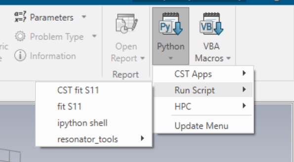

# CST_scripts
A collection of scripts to assist CST workflow

## Requirements
- Python 3.8 or higher, you can use the CST python interpreter
- Resonator tools: https://github.com/sebastianprobst/resonator_tools

## Usage
### Running Script from CST
You can run a python script within the CST UI by adding it to the CST python scripts folder. (Default install location "C:\Program Files (x86)\CST Studio Suite 2025\Library\Python\scripts")  
  

### fit_single_CST_trace.py
Use resonator tools to fit an S11 trace.  
Requires exporting S11 results to a text file as real and imaginary values.

### fit_S11_sweep.py
Use resonator tools to fit all S11 traces from a parametric sweep and plot Qi and Qc.  
Add paths to CST python libraries and your CST project library at top of script.

### CST_fit_S11.py
Fit the S11 result from most recent frequency simulation of the currently open project.   
Calls fit_S11.py within separate process to avoid libiomp5md.dll conficts.

### fit_S11.py
Takes an input and an output file as arguments, fitting the S11 trace in the input file and dumps the fitted parameters into the outfile formatted as a JSON object.

### fit_S11.vba
Workaround to use the CST optimiser for fitted Qc. This script runs CST_fit_S11.py in a terminal and saves the fitted quality factors as 0D results in the CST result tree that can be selected as optimisation goals. The fitting will not be consistent between runs if the total Q or resonant frequency significantly changes requiring a different frequency range to get good fitting results.  
Paste contents of script into a "misc/Run VBA code" result template.
